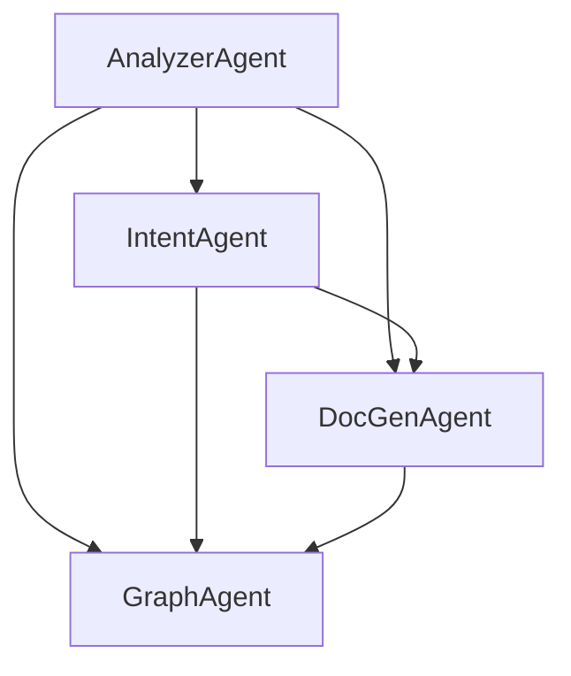

# Agents.md

## 🧭 Repository Context

- **Default Branch for Codex Tasks**: `codex-docs`
- **Default Base Branch for Pull Requests**: `codex-docs`
- **Docs Location**: `docs/`, `codex/`, or root
- **Codex should ignore branches**: [`main`, `staging`] for documentation tasks

---

## 🧠 Agent Overview: Documentation & Analysis

This file defines AI agents specialized in understanding, analyzing, and documenting the structure, design, and intent of the codebase. These agents operate in a **read-only or introspective mode** with respect to the actual source code, but they do create and modify documentation files.

---

## 🧩 Agent Types

| Agent Name        | Description                                                    |
|-------------------|----------------------------------------------------------------|
| `AnalyzerAgent`   | Performs structural and semantic analysis of the codebase      |
| `DocGenAgent`     | Generates architecture, API, and design documentation          |
| `GraphAgent`      | Builds visual representations (e.g., dependency or call graphs)|
| `IntentAgent`     | Extracts and infers design goals, constraints, and architecture|

---

## ⚙️ Agent Lifecycle (Read-Only Mode)

1. **Initialization**  
   Agent is selected based on the task or file type (e.g., `.py`, `.md`, `.ipynb`, or project layout). Since static analysis is usually employed, do not spend time initializing the python environment unless live execution is required.

2. **Discovery**  
   Agent scans the project structure, detects modules, relationships, patterns, and annotations.

3. **Analysis**  
   Agent uses static or semantic analysis to generate internal representations of architecture, API usage, and design motifs.

4. **Documentation**  
   Agent emits Markdown, Mermaid diagrams, or other artifacts into `docs/`, `ARCHITECTURE.md`, or `DESIGN_OVERVIEW.md`.

5. **Finalization**  
   Output is staged for user review or publication, with links to associated source files or graphs.

---

## 🧠 Agent Details

### 🧠 `AnalyzerAgent`
- **Purpose**: Analyze codebase structure, identify layers/modules, trace imports and dependencies
- **Inputs**: Source code tree, project configuration files
- **Outputs**: Dependency maps, class/module hierarchies, design pattern hints

### 🧠 `DocGenAgent`
- **Purpose**: Create human-readable design documents and API overviews
- **Inputs**: AnalyzerAgent output, inline comments, docstrings
- **Outputs**: `ARCHITECTURE.md`, `DESIGN_OVERVIEW.md`, API guides

### 🧠 `GraphAgent`
- **Purpose**: Generate visual diagrams to support architectural understanding
- **Tools**: Mermaid, Graphviz, networkx
- **Outputs**: `*.svg`, Mermaid code blocks, `.png` assets

### 🧠 `IntentAgent`
- **Purpose**: Infer architectural style and constraints (e.g., hexagonal, MVC, microservice)
- **Inputs**: Code annotations, naming conventions, dependency patterns
- **Outputs**: Summary of design intent, integration boundaries, inferred policies

---

## 📘 Documentation Targets

| File Name            | Generated By     | Description                                      |
|----------------------|------------------|--------------------------------------------------|
| `ARCHITECTURE.md`    | DocGenAgent       | High-level system overview with diagrams         |
| `DESIGN_OVERVIEW.md` | DocGenAgent       | Module-level and class-level design commentary   |
| `DEPENDENCIES.md`    | AnalyzerAgent     | Auto-generated dependency trees and modules map  |
| `UML.md`             | GraphAgent        | Class diagrams, flowcharts, and call hierarchies |
| `INTENT.md`          | IntentAgent       | Summary of inferred architecture & style         |

---
## 🧠 Agent Coordination

All agents are orchestrated by a lightweight `AgentManager` that:
- Prioritizes agents based on task type
- Passes structured data between agents
- Ensures documentation consistency across tools and formats
### Execution Order
1. **AnalyzerAgent** → Structural analysis (dependencies, modules)
2. **IntentAgent** → Design pattern inference (uses AnalyzerAgent output)
3. **DocGenAgent** → Documentation generation (uses both previous outputs)
4. **GraphAgent** → Visual diagrams (uses all previous outputs)

### Data Flow

```    

----

## 🧱 Architectural Intent (Optional Metadata)

```yaml
architecture_style: hexagonal
primary_language: python
doc_formats: [markdown, mermaid]
output_directory: docs/
diagram_formats: [mermaid, svg]
```

## 🛠️ Implementation Considerations

### Static Analysis Tools
- **Python**: `ast`, `importlib`, `inspect`
- **Dependency Analysis**: `pipdeptree`, `pydeps`
- **Type Hints**: `typing` module inspection

### Error Handling
- Graceful degradation when analysis fails
- Partial documentation generation
- Warning system for incomplete analysis

### Performance
- Incremental analysis (only changed files)
- Caching intermediate results
- Parallel agent execution where possible
## 📋 Documentation Standards

### Consistent Headers
- `## Overview` - High-level purpose
- `## Architecture` - System design
- `## Components` - Module breakdown
- `## Dependencies` - External/internal deps
- `## Patterns` - Design patterns identified

### Cross-Reference Format
- `[ComponentName](./ARCHITECTURE.md#componentname)`
- `<!-- Generated by: AgentName on YYYY-MM-DD -->`
