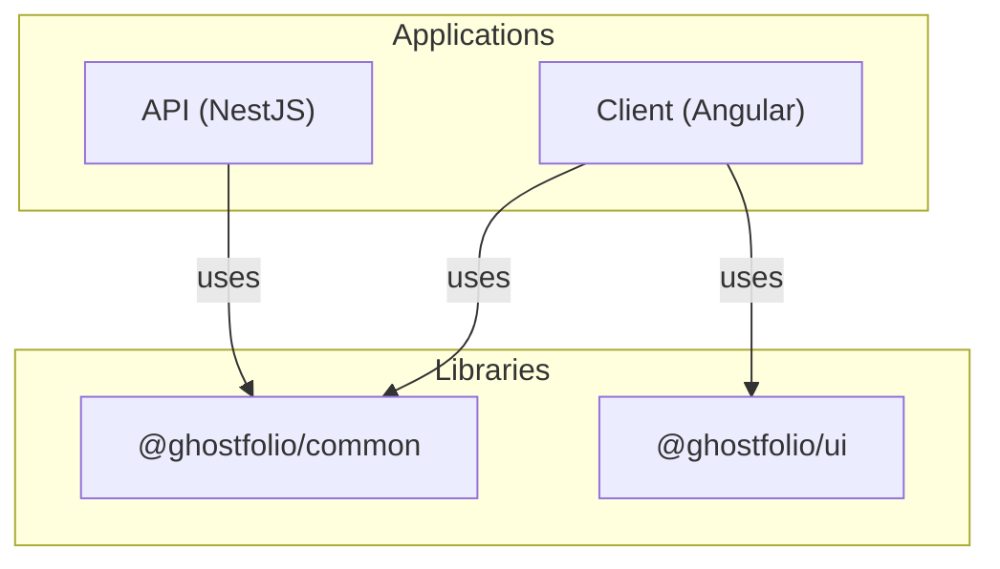

# Architecture

## Overview
Ghostfolio is an open source wealth management application. The repository is structured as an Nx monorepo containing a NestJS API and an Angular client. Shared utilities and UI components live in dedicated libraries.

## Architecture
The project uses Nx to coordinate multiple applications and libraries:

The API communicates with a PostgreSQL database through Prisma and exposes REST endpoints. The client is a multilingual Angular SPA served by the API. Bull queues and scheduled jobs handle background tasks such as data gathering and snapshot computation.

## Components
| Component | Location | Description |
|-----------|----------|-------------|
| **API** | `apps/api` | NestJS backend with numerous modules (access, account, asset, auth, queues, etc.). |
| **Client** | `apps/client` | Angular application providing the user interface and PWA features. |
| **Common** | `libs/common` | Shared TypeScript utilities, configuration values and interfaces. |
| **UI** | `libs/ui` | Reusable Angular components used by the client. |

## Dependencies
The API depends on Prisma, NestJS modules, and Bull for job queues. The client relies on Angular Material and other UI packages. Both apps share TypeScript code from the `common` library.

## Patterns
The code follows modular design principles encouraged by Nx and NestJS. Dependency injection is used extensively across services and controllers. Data provider services implement a common interface to fetch market data from external APIs.

<!-- Generated by: DocGenAgent on 2024-05-18 -->
