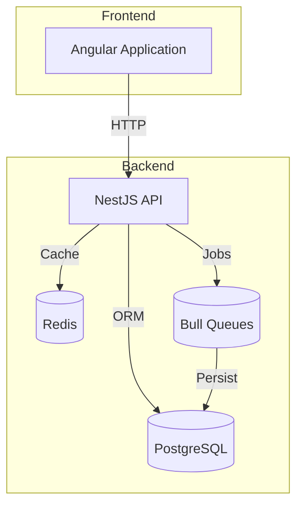

# Architecture

## Overview
Ghostfolio is an open source wealth management software. The project is organized as an [Nx](https://nx.dev) workspace written in TypeScript.

## Architecture
The system uses a client–server model. The backend is built with NestJS using PostgreSQL, Prisma and Redis. The frontend is an Angular application using Angular Material and Bootstrap utility classes.

## Components
| Component | Description |
|-----------|-------------|
| **apps/api** | NestJS server with numerous modules handling authentication, portfolio management, asset data and more. |
| **apps/client** | Angular frontend serving the user interface. |
| **libs/common** | Shared utilities, configuration, interfaces and models. |
| **libs/ui** | Reusable Angular UI components shared across the client. |
| **prisma** | Prisma schema and migrations defining the PostgreSQL database. |

## Dependencies
Internal packages depend on shared libraries under `libs/`. External dependencies include NestJS, Angular, Prisma, Bull, Redis and PostgreSQL.

## Patterns
The repository follows a modular, hexagonal style where domain logic is isolated in services and modules. Nx enforces workspace boundaries and helps manage builds and tests.

<!-- Generated by: DocGenAgent on 2025-06-19 -->
