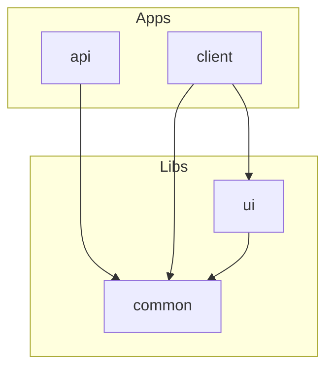

# Dependencies

## Overview
This section outlines the high level relationships between the Nx projects in the repository.

| Project | Depends On |
|---------|------------|
| `apps/api` | `libs/common` |
| `apps/client` | `libs/common`, `libs/ui` |
| `libs/ui` | `libs/common` |
| `libs/common` | – |

External dependencies include NestJS, Angular, Prisma, Redis, PostgreSQL and numerous utility packages declared in `package.json`.

<!-- Generated by: AnalyzerAgent on 2025-06-19 -->
