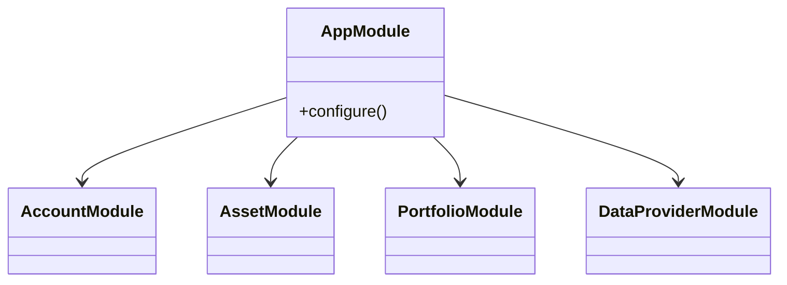

# Design Overview

## Overview
This document provides a deeper look into the module layout and notable implementation details of the Ghostfolio code base.

## Architecture
The project is arranged as an Nx workspace. Applications and libraries are defined in their respective `project.json` files. Each application is built and served via Nx executors.

### API (NestJS)
- Entry point: `apps/api/src/main.ts`.
- Main module: `apps/api/src/app/app.module.ts` wires together domain modules.
- Uses Prisma (`prisma/schema.prisma`) to access a PostgreSQL database.
- Background processing via Bull queues defined in `libs/common/config.ts` (e.g., `DATA_GATHERING_QUEUE`).
- Data providers under `apps/api/src/services/data-provider` implement `DataProviderInterface`.

### Client (Angular)
- Root module defined in `apps/client/src/app/app.module.ts`.
- Supports multiple locales configured in `apps/client/project.json`.
- Shared UI components imported from `libs/ui`.

### Libraries
- **common** – core configuration, helper functions and TypeScript models.
- **ui** – Angular components such as tables, dialogs and charts.

## Components
The following Mermaid diagram outlines relationships between selected server modules:

## Dependencies
Key runtime dependencies include NestJS, Angular, Prisma, Bull, and various market data provider packages as listed in `package.json`.

## Patterns
- **Dependency Injection** – Provided by NestJS for controllers and services.
- **Modular Monorepo** – Nx separates concerns into applications and libraries.
- **Repository Pattern** – Prisma models represent database entities and are accessed via generated client APIs.

<!-- Generated by: DocGenAgent on 2024-05-18 -->
