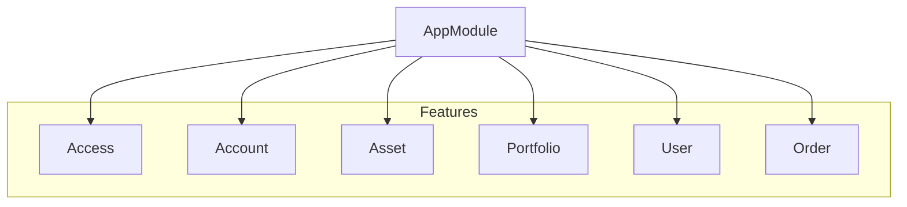

# Design Overview

## Overview
This document describes major modules and how they interact in the Ghostfolio code base.

## Architecture
Ghostfolio follows a modular design. Backend modules are grouped by feature and imported through the main `AppModule`. Frontend modules are composed of Angular feature modules and shared components.

## Components
### Backend Modules
- **access** – manages permissions and shared portfolios
- **account** – handles account and balance records
- **asset** – asset profiles and watch lists
- **order** – tracks buy/sell activities
- **portfolio** – calculates and exposes portfolio metrics
- **user** – registration, authentication and subscription management

### Frontend
The Angular client is organised into feature modules within `apps/client/src/app`. UI widgets live in `libs/ui` and are shared across the app.

## Dependencies
Modules rely on the shared `common` library for helper functions, configuration and TypeScript interfaces. Database access is implemented via Prisma in the `prisma` directory. Bull queues are used for background jobs.

## Patterns
Typical NestJS patterns are used: providers, controllers and modules. The frontend uses Angular services and components. Dependency injection is a core mechanism throughout the stack.

<!-- Generated by: DocGenAgent on 2025-06-19 -->
