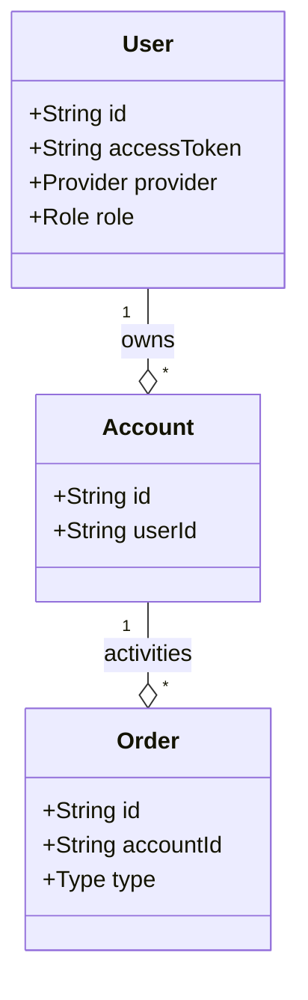

# UML Diagrams

## Overview
The Prisma schema defines the core domain model. The following diagram highlights a subset of the relationships.

```mermaid
classDiagram
  class User {
    +String id
    +String accessToken
    +Provider provider
    +Role role
  }
  class Account {
    +String id
    +String userId
  }
  class Order {
    +String id
    +String accountId
    +Type type
  }
  User "1" --o "*" Account : owns
  Account "1" --o "*" Order : activities
```

<!-- Generated by: GraphAgent on 2025-06-19 -->
