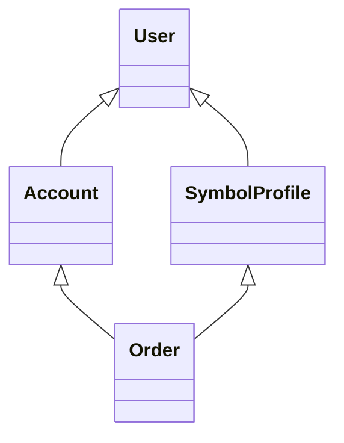
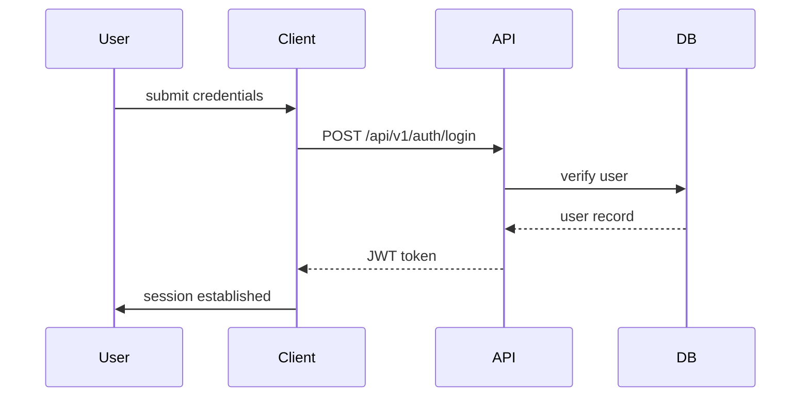
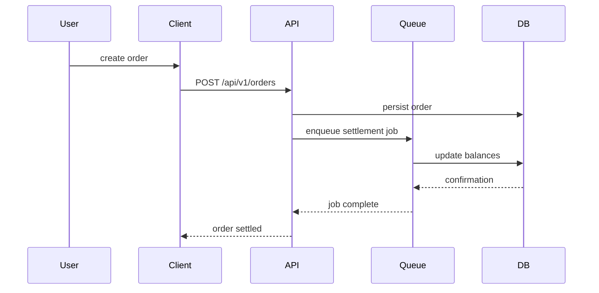
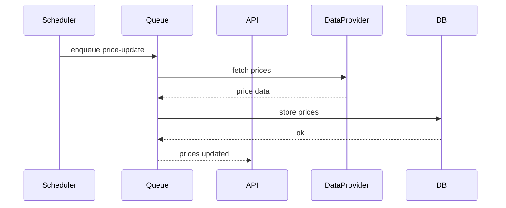
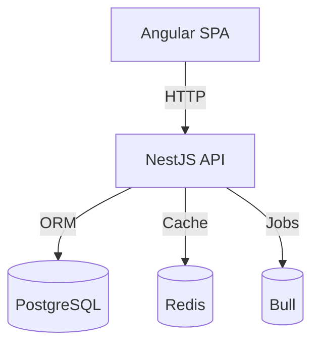

# Architecture Overview

## System Context
Ghostfolio is an Nx monorepo with a NestJS API and Angular client. PostgreSQL and Redis provide persistence and caching. Background tasks run via Bull queues. The system follows a hexagonal architecture separating domain logic from infrastructure concerns.

## Domain Model
The full Prisma schema lives at [../prisma/schema.prisma](../prisma/schema.prisma). It defines entities such as `User`, `Account`, `Order` and `SymbolProfile`. Key relations:
- `User` owns many `Account` and `Order` records.
- `Account` aggregates `Order` transactions and balance snapshots.
- `SymbolProfile` represents tradable symbols watched by users.
- `Order` links a `User` to a `SymbolProfile` through an `Account`.

Invariants:
- Every `Order` references an existing `SymbolProfile`.
- Deleting a `User` cascades to their accounts and orders.
- Currency and data source enums restrict valid values.

## Critical Execution Flows

### 1. User Authentication

### 2. Order Placement and Settlement

### 3. Background Price Update

## Deployment Topology

Last verified on 2025-06-22 @ commit 2634a4fd.
