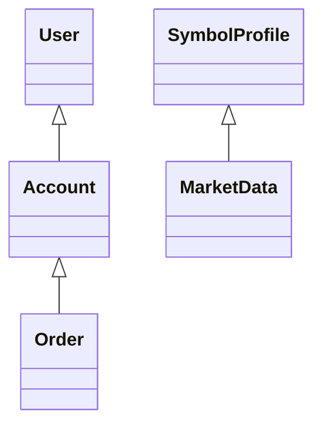
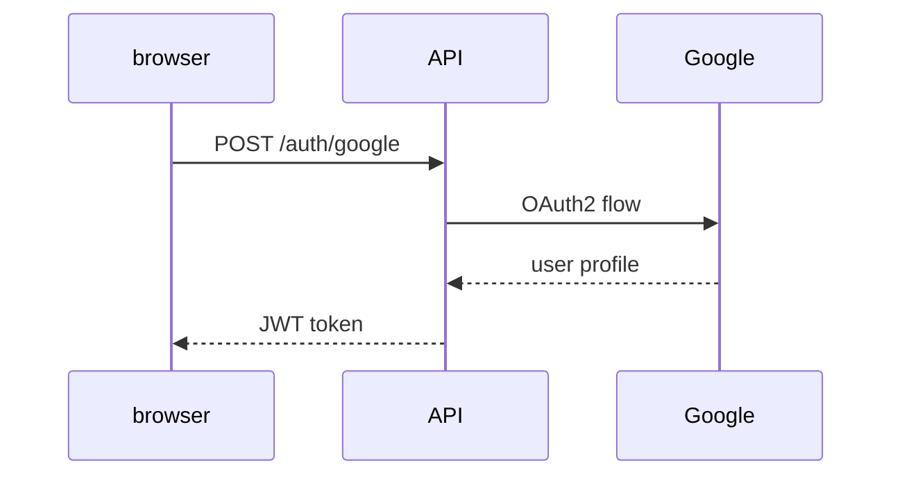
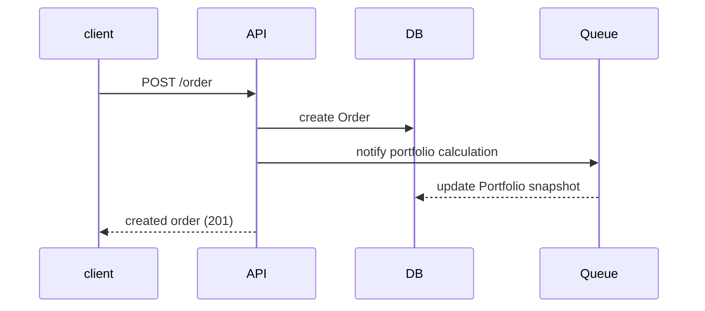
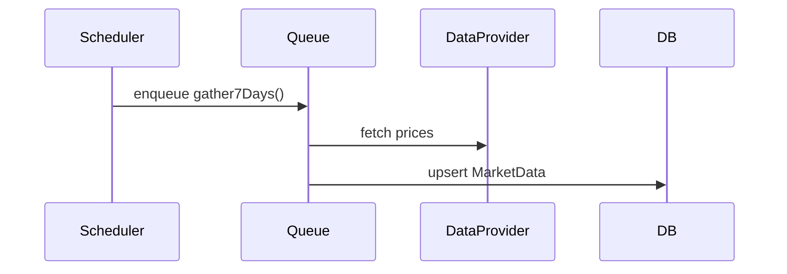

# Architecture Overview

## Overview
Ghostfolio is an Nx monorepo built with NestJS and Angular. Services use PostgreSQL via Prisma and background jobs with Bull and Redis. The code follows a modular hexagonal style separating domain logic from infrastructure.

## Domain Model
The database schema is defined in [../prisma/schema.prisma](../prisma/schema.prisma). Key entities include `User`, `Account`, `Order`, `SymbolProfile`, `MarketData`, `Tag` and `Subscription`. Relationships:
- **User 1-* Account** – a user owns multiple accounts.
- **Account 1-* Order** – accounts record trading activities.
- **User 1-* Tag** – custom tags for orders.
- **SymbolProfile 1-* MarketData** – asset prices over time.

Constraints include composite primary keys on `Account (id,userId)` and unique `(dataSource,symbol,date)` for `MarketData`. Enumerations enforce allowed values for `AssetClass`, `Role`, `Type` and others.

## Critical Execution Flows
### User Authentication

### Order Placement & Settlement

### Background Price Update Job

## Architecture Style
The project uses a layered approach:
- **Presentation** – Angular client and NestJS controllers.
- **Domain** – services encapsulating business rules.
- **Infrastructure** – Prisma data access, Redis cache, Bull queues.

Last verified on 2025-06-22 @ commit 2634a4fd23074adcf5add56123bd7d02863b90e9.
