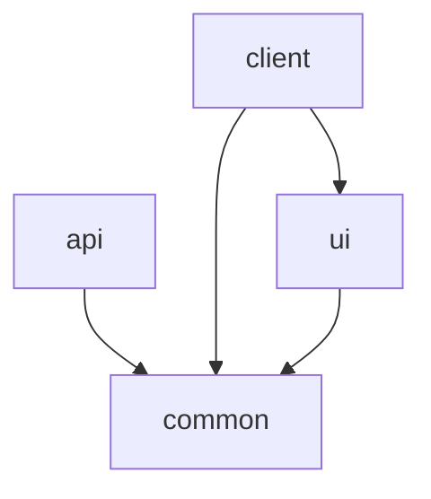

# Module Guide

## Backend Modules
- **access** – permissions and portfolio sharing
- **account** – accounts and balances
- **asset** – asset profiles and watch lists
- **order** – buy/sell activities
- **portfolio** – portfolio metrics
- **user** – authentication and subscriptions

Each module exposes a NestJS `Module` composed of controllers, services and DTOs. Shared logic resides in [`libs/common`](../libs/common/).

### Dependencies

## REST API Surface
Routes are versioned under `/api/v1`.

| Feature | Sample Route | Response |
|---------|--------------|---------|
| Auth | `POST /auth/login` | `{ token: string }` |
| Orders | `POST /orders` | `{ id, status }` |
| Portfolio | `GET /portfolio/summary` | `{ value, allocation }` |

Standard errors use shape `{ statusCode, message }` with appropriate HTTP codes.

## Decision Log
- **Nx** chosen for workspace management and affected builds.
- **NestJS** provides modular structure and TypeScript type safety.
- **Prisma** used for type-safe ORM and migrations.
- **Bull/Redis** handle background jobs and caching.
Alternatives like TypeORM and RabbitMQ were considered but rejected for maturity and simplicity reasons.

## Extensibility Example
To add a new asset-analysis job:
1. Create a processor in [`apps/api/src/services/queues`](../apps/api/src/services/queues).
2. Register the processor in the queue module.
3. Expose a controller endpoint if needed.
4. Update tests under `test/`.

Last verified on 2025-06-22 @ commit 2634a4fd.
